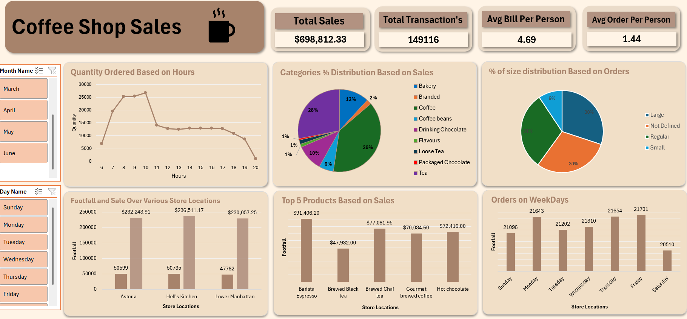

# ☕ Coffee Shop Sales Analysis Dashboard | Microsoft Excel

An interactive Coffee Shop Sales Analysis Dashboard built using Microsoft Excel to analyze sales performance, customer ordering patterns, product performance, store locations, and order trends.

This project was created as a hands-on learning project inspired by the Coffee Shop Sales Analysis tutorial by WsCube Tech and Ayushi Jain.

## 📊 Project Overview

The dashboard transforms coffee shop sales data into an interactive visual report using Excel-based analysis and dashboard techniques.

The main objective was to answer practical business questions such as:

- When are customers ordering the most?
- Which days receive the highest number of orders?
- Which store location performs better in terms of sales and footfall?
- Which products generate the highest sales?
- Which product categories contribute the most to total sales?
- Which order sizes are most common?
- What are the overall sales and transaction metrics?

## 🛠️ Tools & Excel Features Used

- Microsoft Excel
- Pivot Tables
- Pivot Charts
- Interactive Slicers
- Data Analysis
- Dashboard Design
- KPI Cards
- Conditional Formatting
- Worksheet Protection
- Password-Protected Dashboard
- Locked Dashboard Elements
- Interactive Slicers on a Protected Dashboard

## 📌 Key Dashboard KPIs

| KPI | Result |
|---|---:|
| Total Sales | $698,812.33 |
| Total Transactions | 149,116 |
| Average Bill per Person | $4.69 |
| Average Order per Person | 1.44 |

## 🔍 Business Questions & Insights

### 1. What time of the day has the highest order quantity?
**Answer:** 10:00 AM shows the highest order quantity in the dashboard.

### 2. Which day of the week receives the highest number of orders?
**Answer:** Friday records the highest number of orders with **21,701 orders**.

### 3. Which store location generates the highest sales?
**Answer:** Hell's Kitchen has the highest sales at approximately **$236,511.17**.

### 4. Which store location has the highest footfall?
**Answer:** Hell's Kitchen has the highest footfall with **50,735**.

### 5. Which product generates the highest sales?
**Answer:** Barista Espresso is the top-selling product by sales, generating approximately **$91,406.20**.

### 6. Which product category contributes the highest percentage of sales?
**Answer:** Coffee contributes the largest share of sales at approximately **39%**.

### 7. Which order size has the largest share of orders?
**Answer:** Regular-size orders have the largest share at approximately **31%**.

### 8. What is the total sales revenue represented in the dashboard?
**Answer:** The dashboard reports total sales of **$698,812.33**.

### 9. How many transactions are represented in the analysis?
**Answer:** The dataset contains **149,116 transactions**.

### 10. What is the average bill per person?
**Answer:** The average bill per person is **$4.69**.

### 11. What is the average number of orders per person?
**Answer:** The average order per person is **1.44**.

## 📍 Store-Level Sales Analysis

The dashboard compares three store locations:

- Astoria
- Hell's Kitchen
- Lower Manhattan

Sales shown in the dashboard:

- Astoria: **$232,943.91**
- Hell's Kitchen: **$236,511.17**
- Lower Manhattan: **$230,057.25**

This comparison helps identify differences in store-level sales and footfall.

## 📦 Top 5 Products by Sales

1. Barista Espresso — **$91,406.20**
2. Brewed Chai Tea — **$77,081.95**
3. Hot Chocolate — **$72,416.00**
4. Gourmet Brewed Coffee — **$70,034.60**
5. Brewed Black Tea — **$47,932.00**

## 🔐 Dashboard Protection

One additional feature implemented in this project is **worksheet protection**.

The dashboard layout and visual elements were protected using an Excel password. The dashboard elements are locked to prevent direct modification, while the slicers remain available for interactive filtering.

The protection password is kept privately by the project owner and is required to unprotect the worksheet and make protected changes.

This feature demonstrates how an Excel dashboard can be made interactive while also protecting its structure and design.

> Note: Excel worksheet protection is intended to prevent changes to protected worksheet elements; it should not be treated as strong data-security or encryption. 

## 🎯 Learning Outcomes

Through this project, I practiced:

- Building an interactive Excel dashboard
- Using Pivot Tables and Pivot Charts
- Creating KPI cards
- Working with slicers
- Analyzing sales trends
- Comparing store performance
- Identifying top-selling products
- Extracting business insights from data
- Designing a user-friendly dashboard
- Protecting dashboard elements with worksheet protection

## 📷 Dashboard Preview

## 👨‍💻 Project Author

**Tayyab Mehdi**

This project is part of my ongoing journey of learning Excel, Data Analytics, and Business Intelligence.
